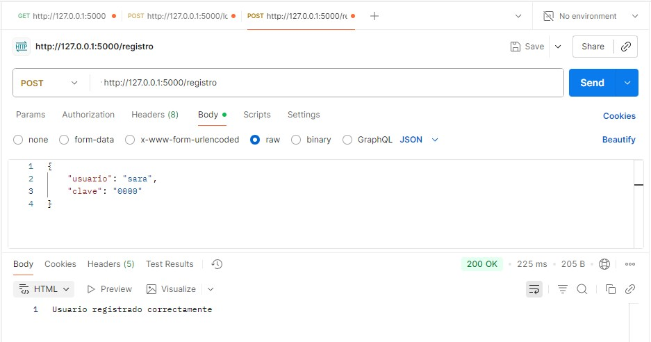
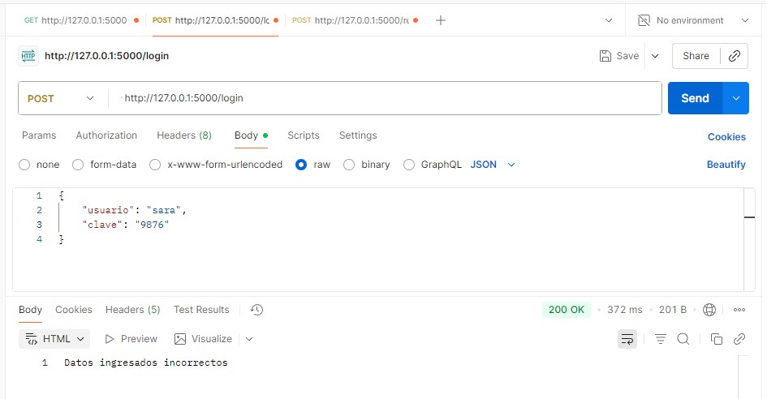
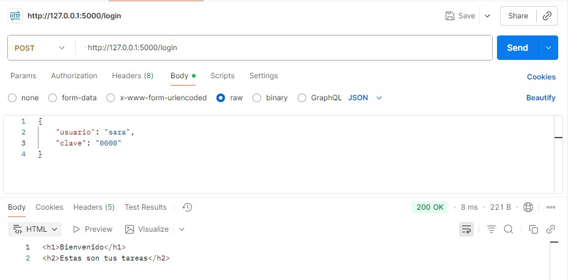
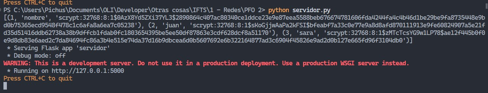

# Sistema de Gestión de Tareas con API y Base de Datos

El sistema está compuesto por un servidor API Flask que implementa una API REST con diferentes endpoints como /registro y /login. Se realiza una autenticación básica con hash de contraseñas y guarda los datos en una base de datos de SQLite

##  El servidor cuenta con lo siguiente:
- función para registrar usuarios y almacenarlos en una base de datos con contraseñas hasheadas
- función para iniciar sesión con verificación de credenciales
- las contraseñas no se almacenan en texto plano sino que se utiliza werkzeug para hashearlas

## Requisitos

- Librerías utilizadas: flask, werkzeug, SQLite (incluída en Python) 

## Instalación del sistema

1. **Clonar el repositorio:**
   ```bash
   git clone <url-del-repositorio>
   cd <PFO 2>
   ```

2. **Instalar dependencias:**
   ```bash
   pip install flask
   ```

## Cómo ejecutar el proyecto en VS Code

1. Abrir carpeta del proyecto en VS Code.
2. Ejecutar el script principal:
   ```bash
   python servidor.py
   ```

## Instrucciones para probar el sistema

1. Realizar pruebas con Postman:
 - POST /registro
 - POST /login
 - GET /
- GET /tareas
   ```JSON
 	{ 
	  "usuario" : "ana",
	  "clave": "1111"
	}
   ```

   ## Pruebas con Postman

   ### Registro de usuarios:

   

   ### Error en el login:

   

   ### Login exitoso:

   

   ### Contraseñas hasheadas:

   


## Respuestas Conceptuales:
   
### ¿Por qué hashear contraseñas?

Hashear contraseñas es un proceso importante en criterios de seguridad ya que permite que las contraseñas se almacenen en la base de datos de forma segura y no como simple texto plano. El proceso de hashear una contraseña evita que se pueda obtener la clave original a partir de la cadena de caracteres almacenada.
De esta manera, solo el usuario conoce la clave de acceso, y las contraseñas no quedan expuestas, lo que protege la seguridad de la cuenta y el acceso al sistema. 


### Ventajas de usar SQLite en este proyecto

SQLite viene incorporada a Python por lo que no requiere una instalación previa ni configuración para su utilización. Solo hay que importar ese módulo y funciona en un solo archivo, lo que la hace adecuada para proyectos como este. 

## Sara E. Olivera
- Para la Segunda Práctica Formativa de Programación sobre Redes
